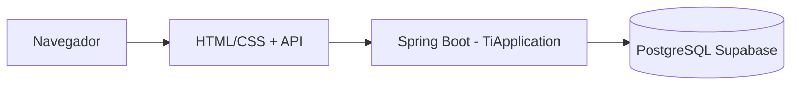

# SecureByte / TI

### Web app de cibersegurança para adolescentes

Aprenda o **básico que importa** na internet — senhas, golpes, phishing e privacidade — em um só lugar.

---

## Objetivo do projeto

| Foco | O que o usuário leva                                                                |
| ---- | ----------------------------------------------------------------------------------- |
| 🎯   | **Hábitos seguros** de forma simples e por **níveis**                               |
| 🛡️  | Reconhecer **riscos comuns** (mensagens falsas, urgência falsa, clonagem de perfil) |
| 🎮   | **Atividades práticas** (e-mail / quiz) + **progresso** e **conquistas**            |

Projeto acadêmico (**Trabalho Integrador**). Linguagem acessível para jovens — o basico da segurança digital.

---

## Stack e o que já existe

- **Backend:** Java 21 + **Spring Boot** (Web MVC, JPA, validação), API REST para usuários e fases.
- **Banco:** **PostgreSQL na nuvem**, hospedado no **[Supabase](https://supabase.com/)** (pool de conexão compatível com JDBC). O JPA (`ddl-auto=update`) sincroniza as entidades com o schema.
- **Frontend:** páginas **HTML/CSS** estáticas — níveis, perfil, conquistas, cadastro/login.
- **Modelo:** usuário com **XP**, **progresso** em fases, **quizzes** e **questões**.

> **Dica:** em projetos gratuitos/inativos no Supabase o banco pode **pausar** após um tempo. Se a API não conectar, abra o painel do Supabase e **retome o projeto**.

---

## Visão geral (arquitetura)

---

## Estrutura do repositório

| Caminho                           | Conteúdo                                |
| --------------------------------- | --------------------------------------- |
| `src/main/java/com/example/demo/` | App Spring Boot, controllers, entidades |
| `src/main/resources/static/`      | Telas, estilos e imagens                |

---

### URLs dos ficheiros em `static/`

No Spring Boot, `src/main/resources/static/` é servido na **raiz** da aplicação (`/`). O segmento `static` **não** entra na URL e nem nos links.

| No repositório              | No browser (ex.: `http://localhost:8080`) |
| --------------------------- | ----------------------------------------- |
| `/index.html`               | `/` ou `/index.html`                      |
| `/TelasIniciais/login.html` | `/TelasIniciais/login.html`               |

Use caminhos que começam **depois** de `static/` (ex.: `/Jogo1-Email/...`). Evite `/static/...` na URL, salvo se tiveres uma pasta `static` *dentro* de `resources/static`.

---

### Telas principais

- `static/index.html` — hub da **Unidade 1**, níveis 1–6.
- `static/TelasIniciais/` — login, cadastro, fluxo de senha.
- `static/Jogo1-Email/` — cenário de **phishing** por e-mail.
- `static/tela-conquistas/` — **conquistas**.
- `static/perfil-usuario/` — perfil, configurações, segurança da conta.

---

## Como rodar

1. Localize a classe `**TiApplication`** em `src/main/java/com/example/demo/TiApplication.java`.
2. Use **Run** na classe (▶ Run / Debug) — o Spring Boot sobe o servidor embutido.

### Banco Supabase — configuração

A URL, usuário e senha vêm do **painel do Supabase** (Database → connection string / pooling). **Não commite** credenciais no Git.

Configure via `application.properties` local (fora do versionamento, se preferir) ou variáveis de ambiente, por exemplo:

- `SPRING_DATASOURCE_URL`
- `SPRING_DATASOURCE_USERNAME`
- `SPRING_DATASOURCE_PASSWORD`

Depois de subir o app, acesse no navegador a URL exibida no console (em geral `http://localhost:8080`).

---

## Conteúdo pedagógico (temas)

| Tema                              | Por que importa                      |
| --------------------------------- | ------------------------------------ |
| 🔑 Senhas fortes e únicas         | Menos contas comprometidas em cadeia |
| 🪝 Phishing e links suspeitos     | Vetor muito comum em e-mail e redes  |
| ⏱️ Urgência e “golpe do parente”  | Engenharia social que mira jovens    |
| 🔒 Privacidade e o que não postar | Menos exposição a abuso online       |
| 📲 Apps oficiais e atualizações   | Menos malware e apps falsos          |

